# Linux Project Implementation

In this project, we will be implementing some basic commands in linux.

## Sudo Command

To use Sudo command, we use the sytax ` sudo apt upgrade ` and can be illustrated in the diagram below.

1. Sudo Command

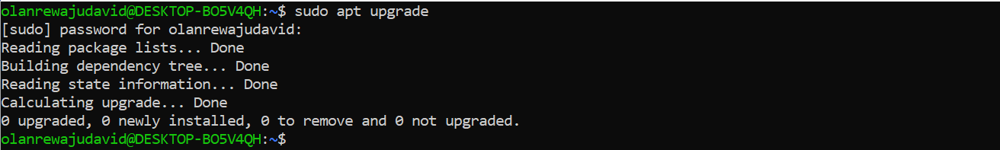

2. pwd Command

3. cd command

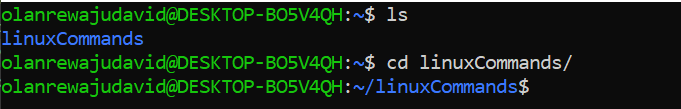

4. ls command

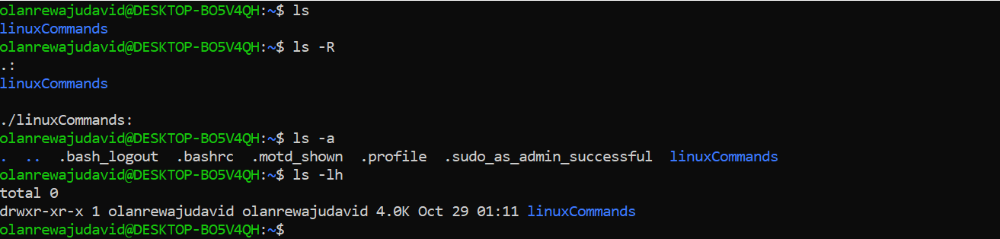

5. cat command

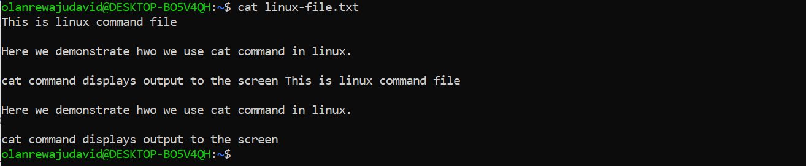

6. cp command

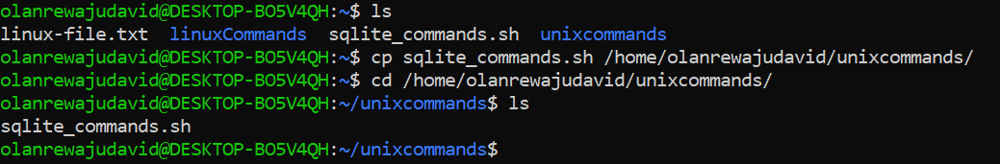

7. mv command

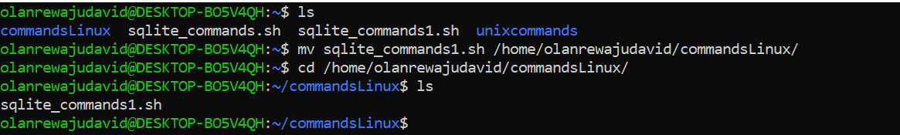

8. mv command to rename a file

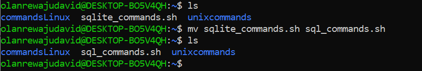

9. mkdir command

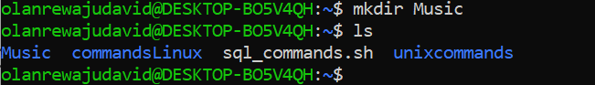

10. mkdir command to make a sub folder dirctory

11. rmdir command 

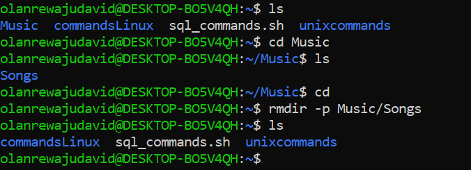

12. touch command 

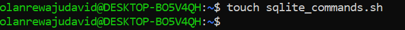

13. find command
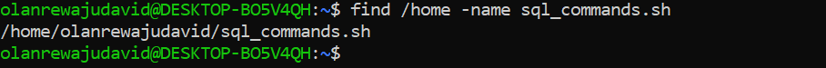

14. df command

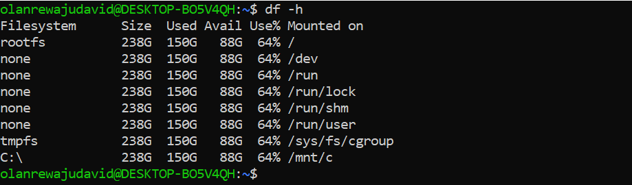

15. du command

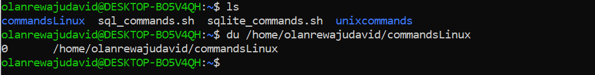

16. head command

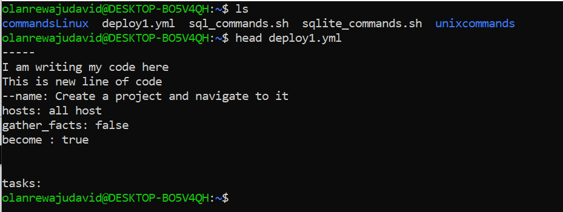

17. tail command

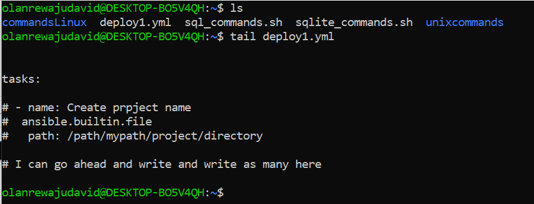

18. diff command 

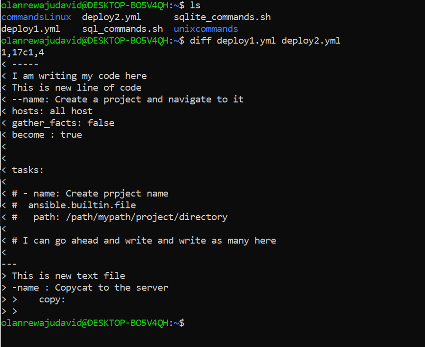

19. uname command

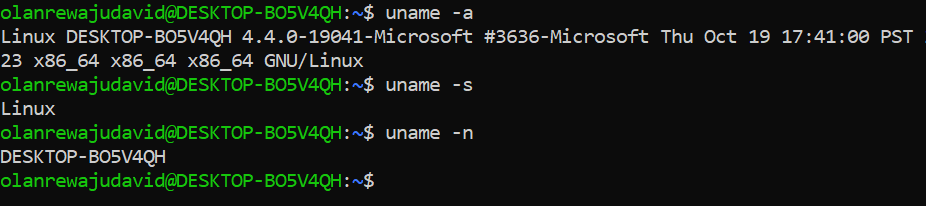

