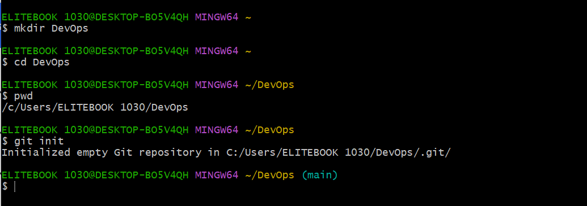
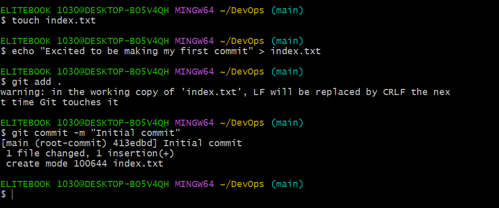
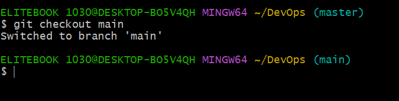
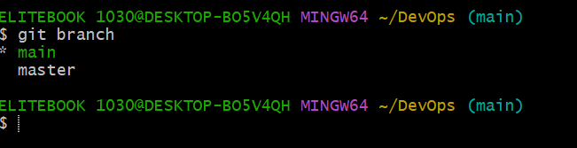
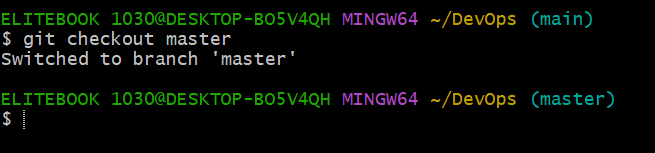
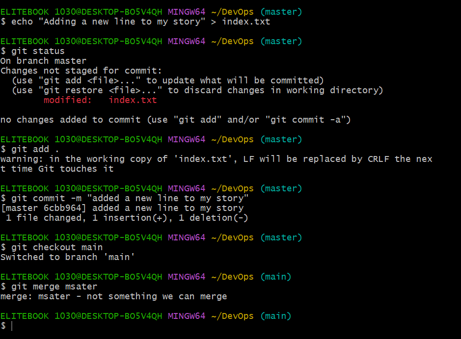

# Github Project Implementation

In this project, we will be implementing the usage of git hub.

# Initializzing resipotory and making commit.
## Run git init to initial your resipotory

# Making your first commit

# Working with branches

## Make your first git branch

# Listing your git branches

# Change into an old branch

# Merging branch to another branch

