# LAMP Stack Project Implementation

## In this project, we will be demonstrating the installation of LAMP Server in following steps

# 1. Installing Apache and updating Firewall

## Firstly, there is need to run the command

**`sudo apt update`** 

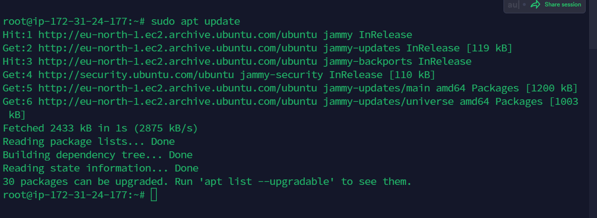


Then Instal Apache using Ubuntu’s package manager ‘apt’:

**`sudo apt install apache2`**
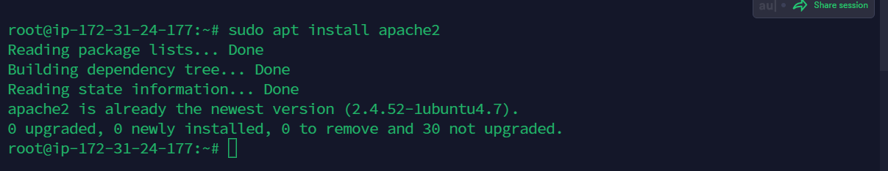

To verify that apache2 is running; run the command bellow

**`sudo systemctl status apache2`**

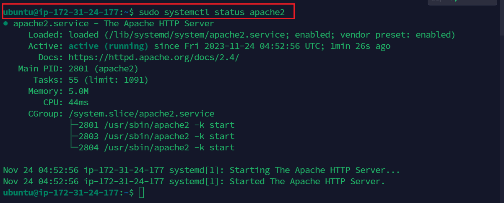

## Add rule to AWS EC2 configuration to open inbound connection through port 80. 

**To Verify apache2 webpage is accessible from the server; use any of the following code**

**`curl http://localhost:80  
or curl http://<public address>:80`**

This can be seen below

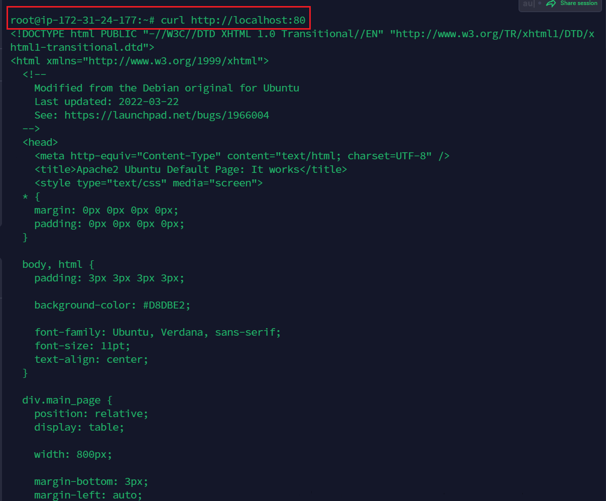


## Test your serve by copying the public address and pasting it on web browser... It works!!!

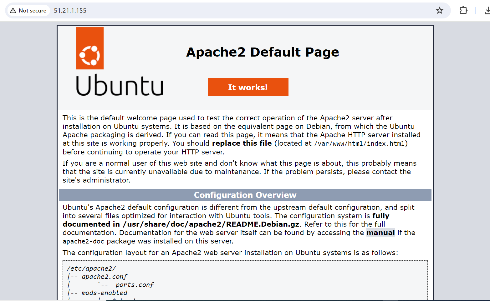


# 2. INSTALLING MYSQL

Install Mysql on the ubuntu server.

 **`$ sudo apt install mysql-server -y`**

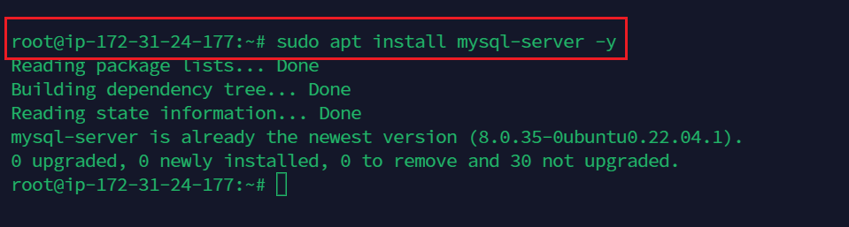

Log into the MySQL console


```Note: I have run sudo -i to gain super admin access to my linux as sudo may not appear in some of the commands in the screenshots```

**`sudo mysql`**
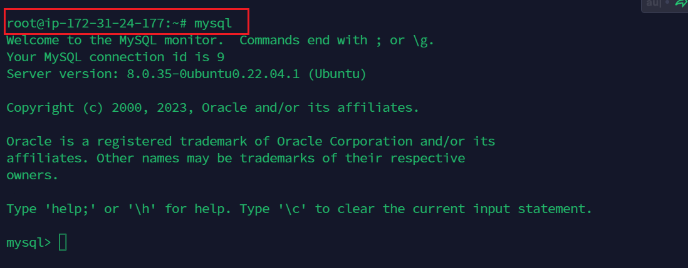


Then configure a database user on and set login password for Mysql

**`ALTER USER 'root'@'localhost' IDENTIFIED WITH mysql_native_password BY 'Password.1';`**


Start MYSQL Interactive script, this will prompt you to configure the validate password plugin.

**`sudo mysql_secure_installation`**
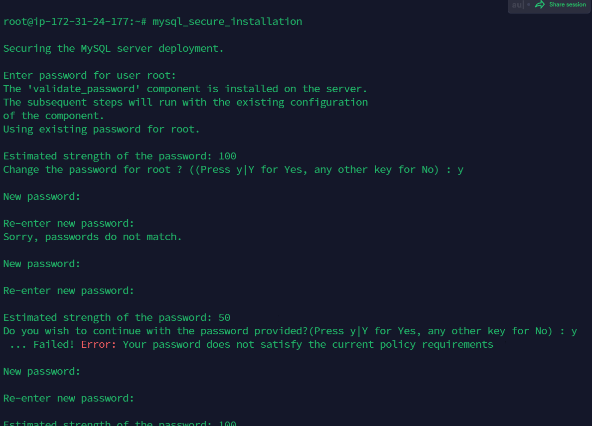

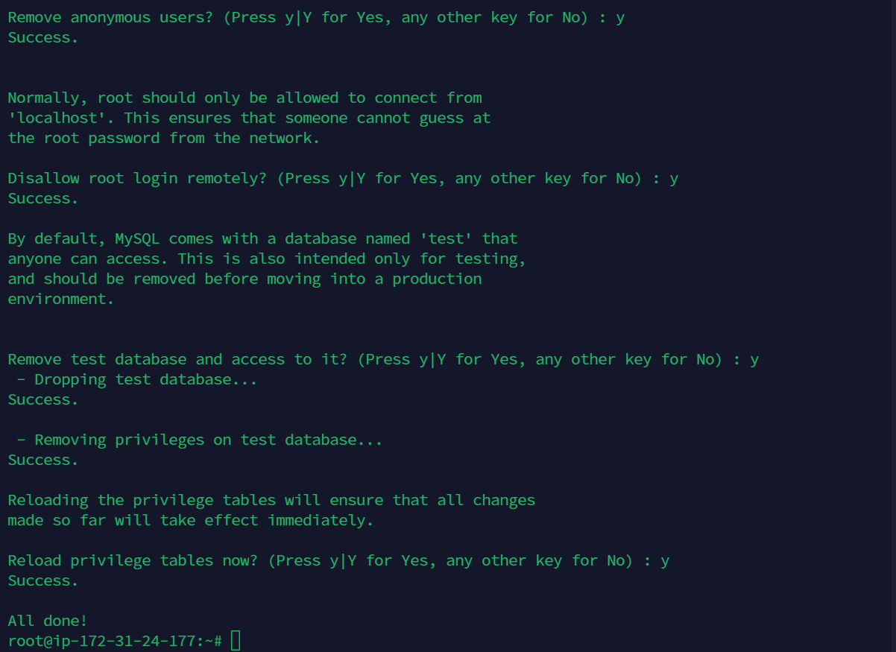


## Confirm and Check the mysql authentication access by typing the command 

**`mysql -p`**

Then exit the shell with the command:  **`exit`**

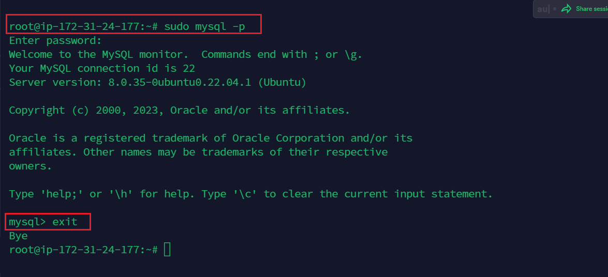

# 3. INSTALLING PHP


3 packages will be installed namely php, libapache2-mod-php, php-mysql. 

**`sudo apt install php libapache2-mod-php php-mysql`**

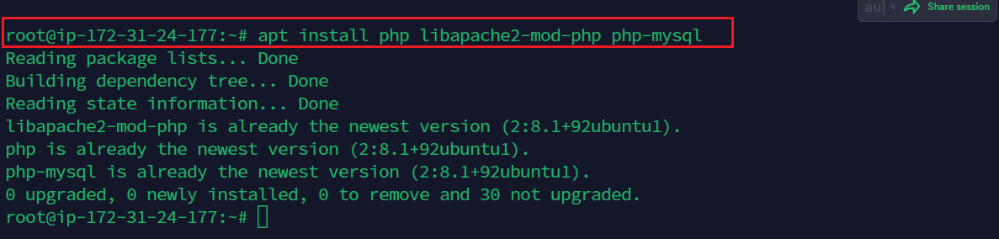

Confirm the php version

**`php -v`**


At this point we have successfully installed all 4 applications that make up the lamp stack

- [x] Linux
- [x] Apache Http Server
- [x] MySQL
- [x] PHP

# 4. ENABLE PHP ON THE WEBSITE

With the default DirectoryIndex settings on Apache, the index.html file takes precedence, lets modify this and give precedence to the index.php file.

We need to edit the /etc/apache2/mods-enabled/dir.conf file and change the order in which the index.php file is listed within the DirectoryIndex directive:

**`sudo vim /etc/apache2/mods-enabled/dir.conf`**

```
<IfModule mod_dir.c>
        #Change this:
        #DirectoryIndex index.html index.cgi index.pl index.php index.xhtml index.htm
        #To this:
        DirectoryIndex index.php index.html index.cgi index.pl index.xhtml index.htm
</IfModule>
```
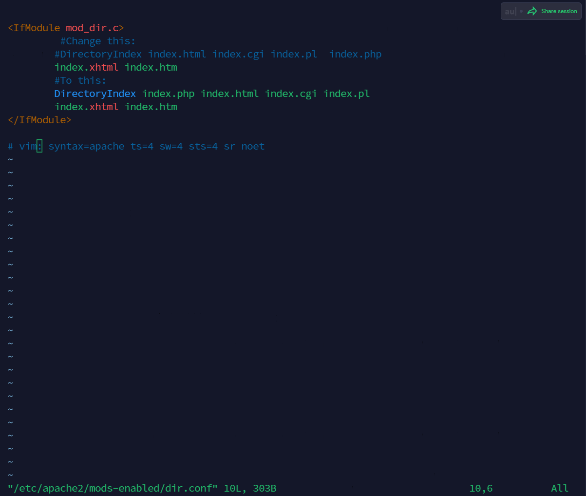


Restart the apache using the command below.

**`sudo systemctl reload apache2`**


