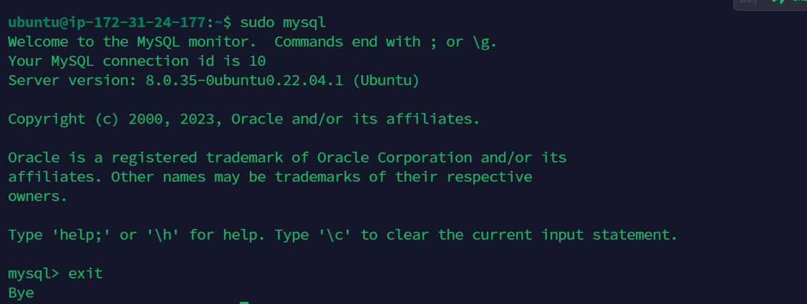

# LAMP Stack Project Implementation

## In this project, we will be demonstrating the installation of LAMP Server.

## Installing Apache and updating Firewall

## Firstly, there is need to run the command

**`sudo apt update`**

Then Instal Apache using Ubuntu’s package manager ‘apt’:

**`sudo apt install apache2`**

To verify that apache2 is running; run the command bellow

**`sudo systemctl status apache2`**

## Add rule to AWS EC2 configuration to open inbound connection through port 80. 

**To Verify apache2 webpage is accessible from the server; use any of the following code**

**`curl http://localhost:80  
or curl http://<public address>:80`**

## Test your serve by copying the public address and pasting it on web browser... It works!!!

## .............................. INSTALLING MSQL................................

Install Mysql on the ubuntu server.

 **`$ sudo apt install mysql-server -y`**

Log into the MySQL console

**`sudo mysql`**

configure a database user on and set login password for Mysql

**`ALTER USER 'root'@'localhost' IDENTIFIED WITH mysql_native_password BY 'PassWord.1';`**

Exit the shell with **`Exit`**

Start MYSQL Interactive script, this will prompt you to configure the validate password plugin.

**`sudo mysql_secure_installation`**

Confirm ability to login to Mysql by running the commmand.

**`sudo mysql -p`**

To exit the MySQL console, type:

**`mysql> exit`**

## ................................ INSTALLING PHP ..................................
---

3 packages will be installed namely php, libapache2-mod-php, php-mysql. 

**`sudo apt install php libapache2-mod-php php-mysql`**

Confirm the php version

**`php -v`**

At this point we have successfully installed all 4 applications that make up the lamp stack

- [x] Linux
- [x] Apache Http Server
- [x] MySQL
- [x] PHP
