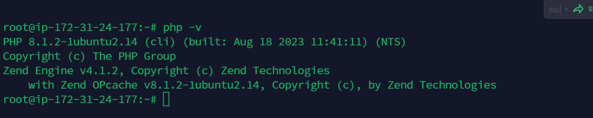
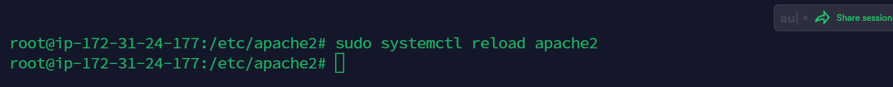

# LAMP Stack Project Implementation

## In this project, we will be demonstrating the installation of LAMP Server in following steps

# 1. Installing Apache and updating Firewall

## Firstly, there is need to run the command

**`sudo apt update`** 


Then Instal Apache using Ubuntu’s package manager ‘apt’:

**`sudo apt install apache2`**


To verify that apache2 is running; run the command bellow

**`sudo systemctl status apache2`**


## Add rule to AWS EC2 configuration to open inbound connection through port 80. 

**To Verify apache2 webpage is accessible from the server; use any of the following code**

**`curl http://localhost:80  
or curl http://<public address>:80`**

This can be seen below


## Test your serve by copying the public address and pasting it on web browser... It works!!!


# 2. INSTALLING MYSQL

Install Mysql on the ubuntu server.

 **`$ sudo apt install mysql-server -y`**


Log into the MySQL console


```Note: I have run sudo -i to gain super admin access to my linux as sudo may not appear in some of the commands in the screenshots```

**`sudo mysql`**


Then configure a database user on and set login password for Mysql

**`ALTER USER 'root'@'localhost' IDENTIFIED WITH mysql_native_password BY 'Password.1';`**


Start MYSQL Interactive script, this will prompt you to configure the validate password plugin.

**`sudo mysql_secure_installation`**


## Confirm and Check the mysql authentication access by typing the command 

**`mysql -p`**

Then exit the shell with the command:  **`exit`**


# 3. INSTALLING PHP


3 packages will be installed namely php, libapache2-mod-php, php-mysql. 

**`sudo apt install php libapache2-mod-php php-mysql`**


Confirm the php version

**`php -v`**



At this point we have successfully installed all 4 applications that make up the lamp stack

- [x] Linux
- [x] Apache Http Server
- [x] MySQL
- [x] PHP


##  ...........CREATING A VIRTUAL HOST FOR YOUR WEBSITE USING APACHE .........

We will setup a virtual host to test the PHP script, virtual host enables you to setup multiple websites on a single server.

Create the directory for projectlamp using ‘mkdir’ command

**`sudo mkdir /var/www/projectlamp`**

Next, assign ownership of the directory with your current system user:

**`sudo chown -R $USER:$USER /var/www/projectlamp`**

As seen in the diagram below


Create and open a new configuration file in Apache’s sites-available directory.

**`sudo vi /etc/apache2/sites-available/projectlamp.conf`**

Paste below code into the file created above.
```
<VirtualHost *:80>
    ServerName projectlamp
    ServerAlias www.projectlamp 
    ServerAdmin webmaster@localhost
    DocumentRoot /var/www/projectlamp
    ErrorLog ${APACHE_LOG_DIR}/error.log
    CustomLog ${APACHE_LOG_DIR}/access.log combined
</VirtualHost>
```


Enable the new virtual host with the a2ensite command 

**`sudo a2ensite projectlamp`**

Disable the default site with a2dissite command

**`sudo a2dissite 000-default`**


Reload Apache service for changes to take efffect

**`sudo systemctl reload apache2`**

**Create an index file in the projectlamp folder.**

```
sudo echo 'Hello LAMP from hostname' $(curl -s http://169.254.169.254/latest/meta-data/public-hostname) 'with public IP' $(curl -s http://169.254.169.254/latest/meta-data/public-ipv4) > /var/www/projectlamp/index.html

```


Go to your browser and try to open your website URL using IP address:

**`http://<Public-IP-Address>:80`** 

## Great!!! It works!


# 5. ENABLE PHP ON THE WEBSITE

Edit the /etc/apache2/mods-enabled/dir.conf file and change the order in which the index.php file is listed within the DirectoryIndex directive:

**`sudo vim /etc/apache2/mods-enabled/dir.conf`**

```
<IfModule mod_dir.c>
        #Change this:
        #DirectoryIndex index.html index.cgi index.pl index.php index.xhtml index.htm
        #To this:
        DirectoryIndex index.php index.html index.cgi index.pl index.xhtml index.htm
</IfModule>
```


Restart the apache using the command below.

**`sudo systemctl reload apache2`**



Create a new file named index.php inside the projectlamp root folder:

**`vim /var/www/projectlamp/index.php`**

```
<?php
phpinfo();

```


## Refreshing the page; It looks like below


It is advisable to remove the file as it contains sensitive information about your server and php site config.

**`sudo rm /var/www/projectlamp/index.php`**

# **----------------The Job is DONE!!! Thank you!!---------------**

