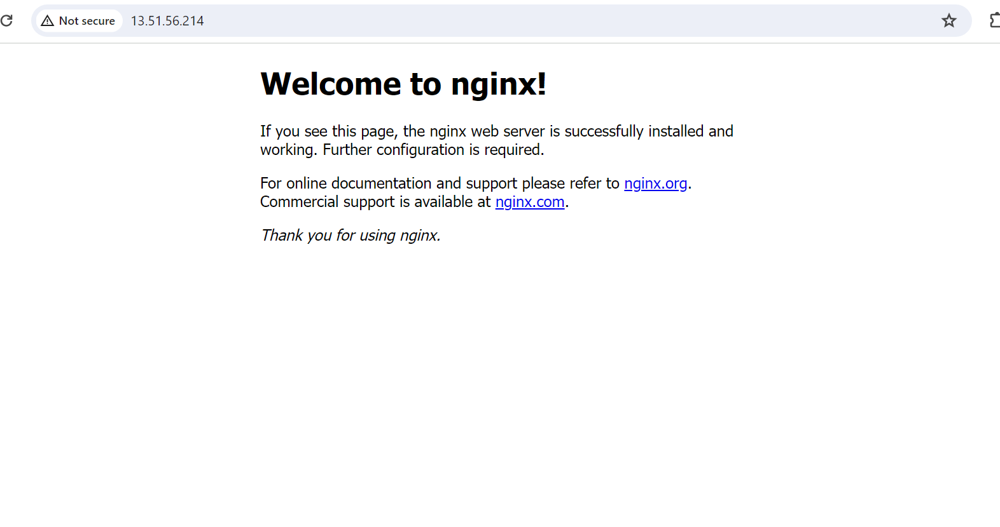
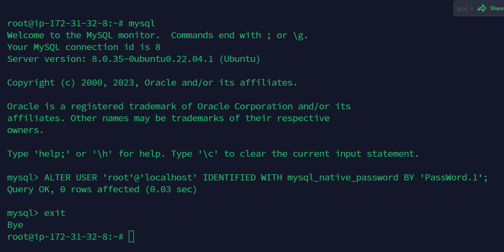
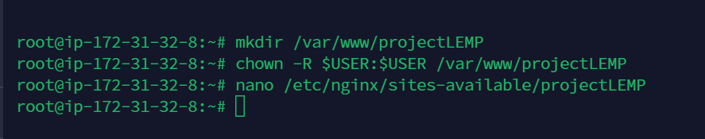
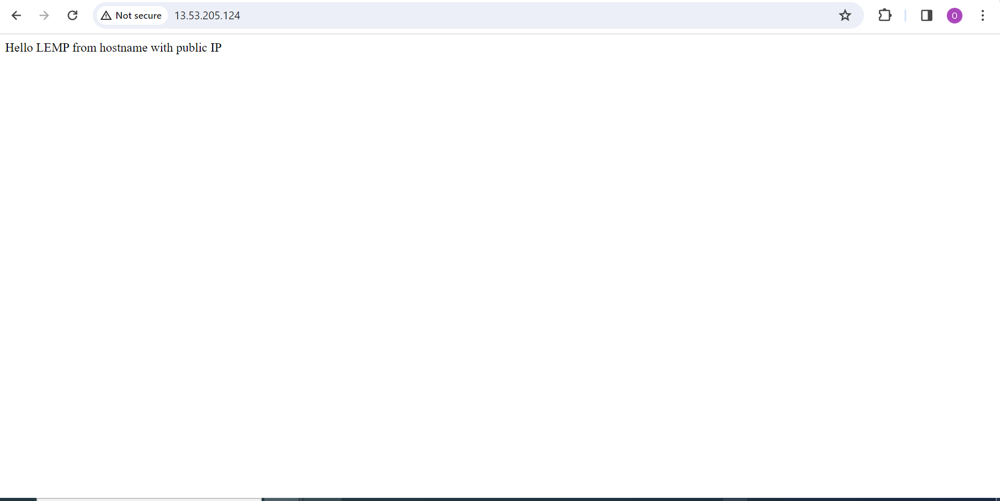
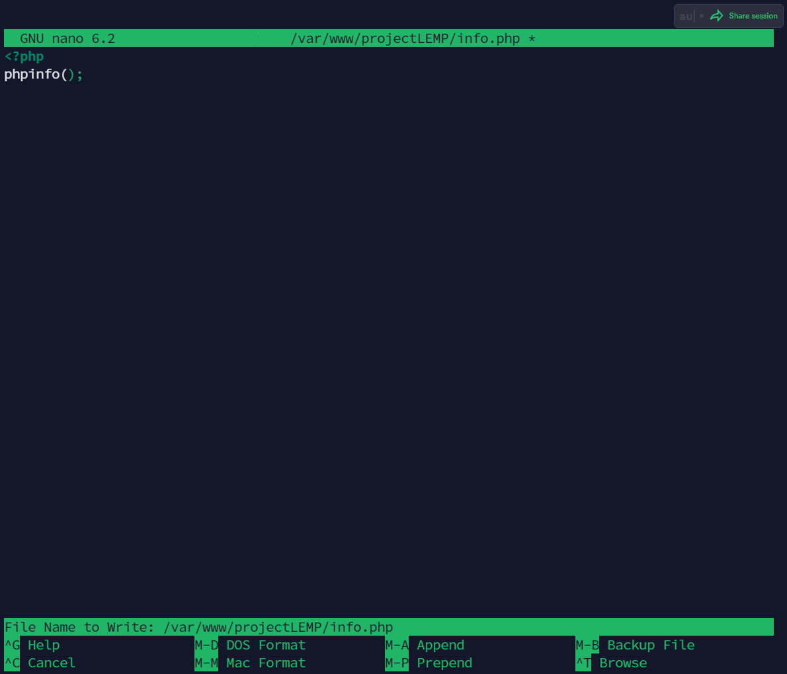

# AWS LEMP STACK IMPLEMENTATION
 ## **This project shows how to implement LEMP stack** (Linux-Nginx-Mysql-Php) on AWS in a sequential steps.

 ## STEP 1 - INSTALLING THE NGINX WEBSERVER
--- 
 Update a list of packages in package manager

**`sudo apt update -y`**


Run Nginx package installation

**`sudo apt install nginx`**


Verify Nginx is Up and running.

**`sudo systemctl status nginx`**


```
Add rule to AWS EC2 configuration to open inbound connection through port 80. This is done already on AWS...
```


ALso verify the web server is reachable from the localhost as thus:

```
 curl http://localhost:80

or

 curl http://127.0.0.1:80
 
```


Test and View the Nginx server on the web browser using the public IP address

**`http://<Public-IP-Address>:80`**




## STEP 2 - INSTALLING MYSQL

Install MYSQL package using apt command

**`sudo apt install mysql-server -y`**


Log into Mysql console.

**`sudo mysql`**


Run a security script that comes with Mysql to change some insecure default settings, but before then, set root password as shown below.

**`ALTER USER 'root'@'localhost' IDENTIFIED WITH mysql_native_password BY 'Password.1'`**

Exit Mysql.

**`exit`**

The above demostration codes can be seen below:




Run the security with the command.

**`sudo mysql_secure_installation`**


Run the code below to test mysql log-in

**`sudo mysql -p`**

After succcessful confimation of login, you can exit MYSQL

**`exit`**


### ---- MYSQL SUCCESSFULLY INSTALLED!!! ----------
##

## STEP 3 - INSTALLING PHP
---

Install PHP and its dependencies will be installed automatically.

**`sudo apt install php-fpm php-mysql -y`**


## STEP 4 - CONFIGURING NGINX TO USE PHP

We will create a folder called projectLEMP for our webserver.
Create the root web directory for your_domain in /var/www/ folder as follows:

**`sudo mkdir /var/www/projectLEMP`**

Next, assign ownership of the directory with the $USER environment variable, which will reference your current system user:

**`sudo chown -R $USER:$USER /var/www/projectLEMP`**

Open a new configuration file in Nginx’s sites-available directory

**`sudo nano /etc/nginx/sites-available/projectLEMP`**




Save and close the file.

Activate the configuration by linking the config file from Nginx’s sites-enabled directory.

**`sudo ln -s /etc/nginx/sites-available/projectLEMP /etc/nginx/sites-enabled/`**

Test for syntax error

**`$ sudo nginx -t`**


Disable default Nginx host that is currently configured to listen on port 80, for this run:

**`sudo unlink /etc/nginx/sites-enabled/default`**

Let's reload NGINX to apply these changes. 

**`sudo systemctl reload nginx`**

Create an index.html file in the location /var/www/projectLEMP so that we can test that your new server block works as expected:

```
sudo echo 'Hello LEMP from hostname' $(curl -s http://169.254.169.254/latest/meta-data/public-hostname) 'with public IP' $(curl -s http://169.254.169.254/latest/meta-data/public-ipv4) > /var/www/projectLEMP/index.html
```


Now let's try to open the website URL from the browser using IP address or DNS name:

**`http://<Public-IP-Address>:80`**  or  **`http://<Public-DNS-Name>:80`**




## STEP 5 - TESTING PHP WITH NGINX

This can be done this by creating a test PHP file in the document root. 

Open a new file called info.php:

**`sudo nano /var/www/projectLEMP/info.php`**



Accees on web browser:

`http://`server_domain_or_IP`/info.php`


You can always remove the file above as it contains a very sensitive information:

**`sudo rm /var/www/your_domain/info.php`**


## STEP 6 - RETRIEVING DATA FROM MYSQL DATABASE WITH PHP
---

create a database named lemp_database and a user named lemp_user.

First, connect to the MySQL console using the root account and password:

**`sudo mysql -p`**

Create a new database and user.

**`mysql> CREATE DATABASE `\`example_database \`;**


Create a new user and grant it full privileges on the database.

**`mysql>  CREATE USER 'example_user'@'%' IDENTIFIED WITH mysql_native_password BY 'Password.1';`**

Give this user permission over the lemp_database database:

`mysql> GRANT ALL ON example_database.* TO 'example_user'@'%';`

This will give the lemp_user user full privileges over the   **example_database** database, while preventing this user from creating or modifying other databases on your server.

Exit the MySQL shell with:  **`exit`**

Above codes can be illustrated in the picture below.


Log in to `example_database` with the new `example_user` account created.

**`mysql -u example_user -p example_database`**

Confirm we have access to `example_database`.

**`mysql> SHOW DATABASES;`**

Next, create a test table named todo_list with the following statement:

```
 CREATE TABLE example_database.todo_list (item_id INT AUTO_INCREMENT,content VARCHAR(255),PRIMARY KEY(item_id));
```

Insert a few rows of content in the example table by repeating the next command a few times, using different VALUES:

```
INSERT INTO example_database.todo_list (content) VALUES ("My first database item");
INSERT INTO example_database.todo_list (content) VALUES ("My second important item");
```

See Picture Below:


To see the contents of the table, run the command:

**`mysql> select * from example_database.todo_list;`**

exit MYSQL.
**`exit`**


Create a PHP script that will connect to MySQL and query the content by creating a new PHP file in the custom web root directory.

**`nano /var/www/projectLEMP/todo_list.php`**

```
<?php
$user = "example_user";
$password = "PassWord.1";
$database = "example_database";
$table = "todo_list";

try {
  $db = new PDO("mysql:host=localhost;dbname=$database", $user, $password);
  echo "<h2>TODO</h2><ol>";
  foreach($db->query("SELECT content FROM $table") as $row) {
    echo "<li>" . $row['content'] . "</li>";
  }
  echo "</ol>";
} catch (PDOException $e) {
    print "Error!: " . $e->getMessage() . "<br/>";
    die();
}
```
Save and close the file.

Now access the todo_list.php page from the web browser

**`http://<Public_domain_or_IP>/todo_list.php`**


### ***Done! Thank you !!!*** 

### - David Owopetu
