# INTRODUCTION TO SHELL SCRIPTING AND USER INPUT
 ## **This project demonstrate the syntax and usage of shell scripting.

 ## A - SHELL SCRIPTING SYNTAX ELEMENT 


## Firstly, make a shecript file that is executable using the following commands:

**`touch myscript.sh`**
**`chmod +x myscript `**

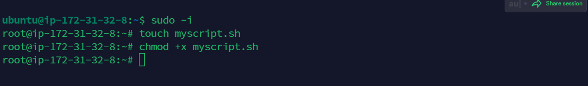

Add the lines into the script created: 
**`#! /bin/bash" `**


## 1. Syntax elements
Assigning value to a variable

**`name="John" `**

Retrieving value from a variable
**`echo $name`**

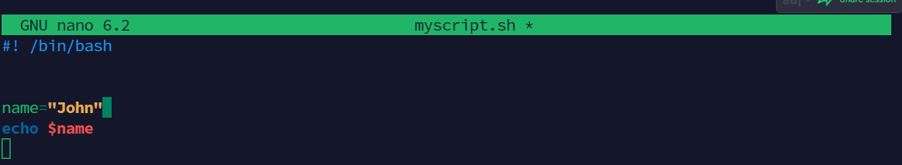
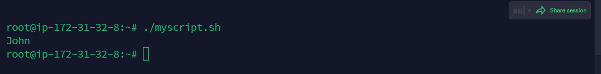


## 2. COTROL FLOW

```
#!/bin/bash

# Example script to check if a number is positive, negative, or zero

read -p "Enter a number: " num

if [ $num -gt 0 ]; then
    echo "The number is positive."
elif [ $num -lt 0 ]; then
    echo "The number is negative."
else
    echo "The number is zero."
fi

```
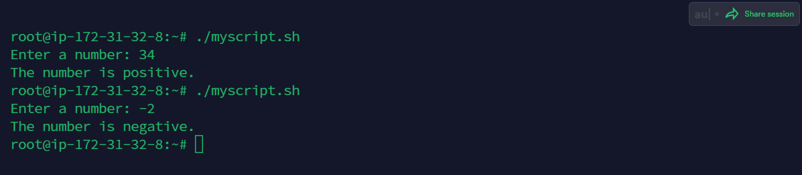

## 3. Iterating through a loop

Copy below script into myscript.sh and run bash shell with ./myscript.sh

```
#!/bin/bash

# Example script to print numbers from 1 to 5 using a for loop

for (( i=1; i<=5; i++ ))
do
    echo $i
done

```
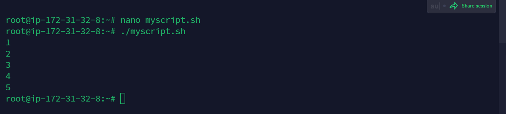

## 4. Input and Output

Accept user input

```
echo "Enter your name:"
read name

```

```
echo "Hello World"

```


Output content into a file:

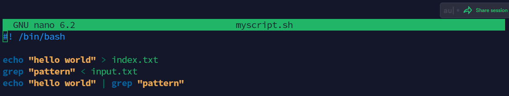
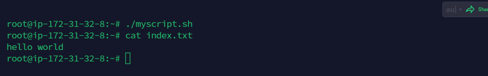


## 5. Functions

Copy below script into myscript.sh and run bash shell with ./myscript.sh

```
#!/bin/bash

# Define a function to greet the user
greet() {
    echo "Hello, $1! Nice to meet you."
}

# Call the greet function and pass the name as an argument
greet "John"

```

Output:

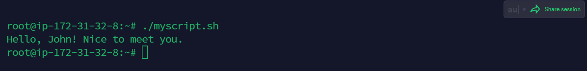


## --- A. CONTINUED - WRITING FIRST SHELL SCRIPT --

Step 1 Open terminal and run the command
**`mkdir shell-scripting`**

Step 2 Creat a fill using the code **`touch user-input.sh`**

Step 3 Copy and paste the below code into the file

```

#!/bin/bash

# Prompt the user for their name
echo "Enter your name:"
read name

# Display a greeting with the entered name
echo "Hello, $name! Nice to meet you."

```
Step 4 Save file
STep 5 Run **`sudo chmod +x user-input.sh`** //to make file executable

--> Run the script uaing the command **`./user-input`**

Result:

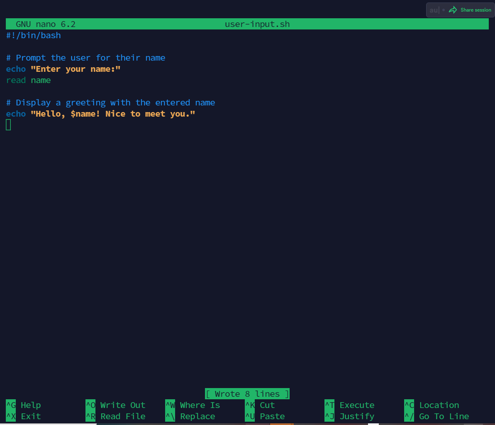


## --- B. DIRECTORY MANIPULATION AND NAVIGATION ---

Step 1. Open a file named navigating-linux-filesystem.sh using the command:
 **`touch navigating-linux-filesystem.sh`**

Step 2. Paste the code block below into the file

```
#!/bin/bash

# Display current directory
echo "Current directory: $PWD"

# Create a new directory
echo "Creating a new directory..."
mkdir my_directory
echo "New directory created."

# Change to the new directory
echo "Changing to the new directory..."
cd my_directory
echo "Current directory: $PWD"

# Create some files
echo "Creating files..."
touch file1.txt
touch file2.txt
echo "Files created."

# List the files in the current directory
echo "Files in the current directory:"
ls

# Move one level up
echo "Moving one level up..."
cd ..
echo "Current directory: $PWD"

# Remove the new directory and its contents
echo "Removing the new directory..."
rm -rf my_directory
echo "Directory removed."

# List the files in the current directory again
echo "Files in the current directory:"
ls

```

Step 3: Run the command for executing permision:

**`sudo chmod +x navigating-linux-filesystem.sh`**

Step 4: Run the script using the command:

**`sudo ./navigating-linux-filesystem.sh`**


Result:

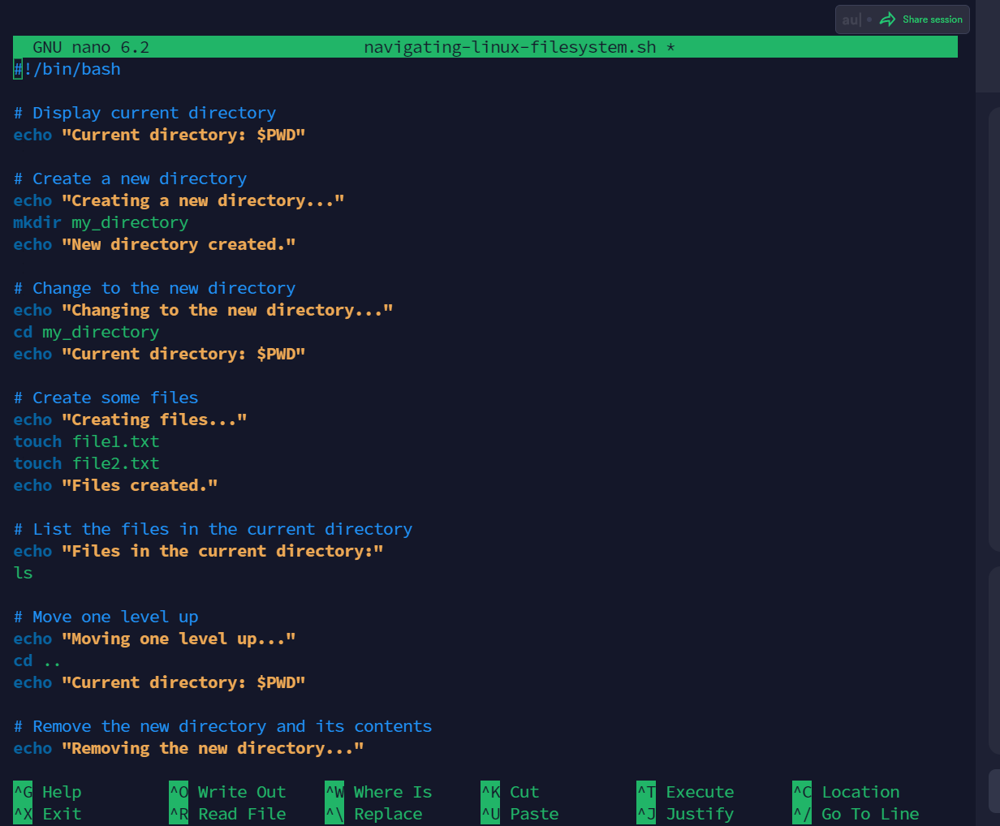

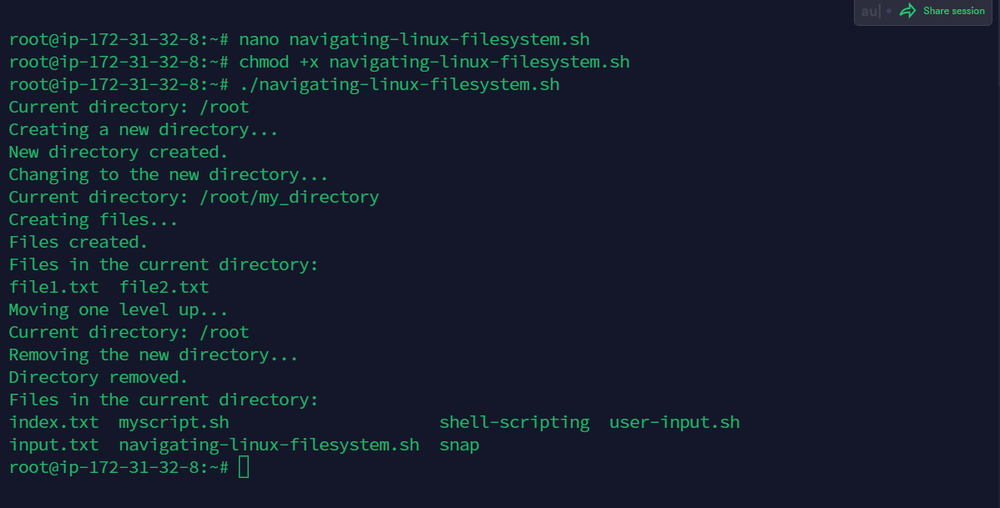


## --- C. FILE OPERATIONS AND SORTING ---


Step 1. Open a file named sorting.sh using the command:
    **`touch sorting.sh`**

Step 2. Paste the code block below into the file

```
#!/bin/bash

# Create three files
echo "Creating files..."
echo "This is file3." > file3.txt
echo "This is file1." > file1.txt
echo "This is file2." > file2.txt
echo "Files created."

# Display the files in their current order
echo "Files in their current order:"
ls

# Sort the files alphabetically
echo "Sorting files alphabetically..."
ls | sort > sorted_files.txt
echo "Files sorted."

# Display the sorted files
echo "Sorted files:"
cat sorted_files.txt

# Remove the original files
echo "Removing original files..."
rm file1.txt file2.txt file3.txt
echo "Original files removed."

# Rename the sorted file to a more descriptive name
echo "Renaming sorted file..."
mv sorted_files.txt sorted_files_sorted_alphabetically.txt
echo "File renamed."

# Display the final sorted file
echo "Final sorted file:"
cat sorted_files_sorted_alphabetically.txt

```

Step 3: Run the command for executing permision:

**`sudo chmod +x sorting.sh`**

Step 4: Run the script using the command:

**`sudo ./sorting.sh`**


Result:

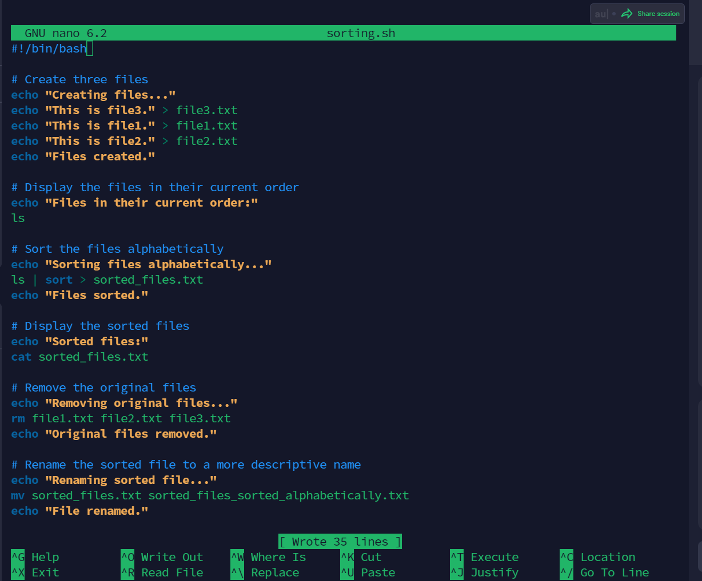

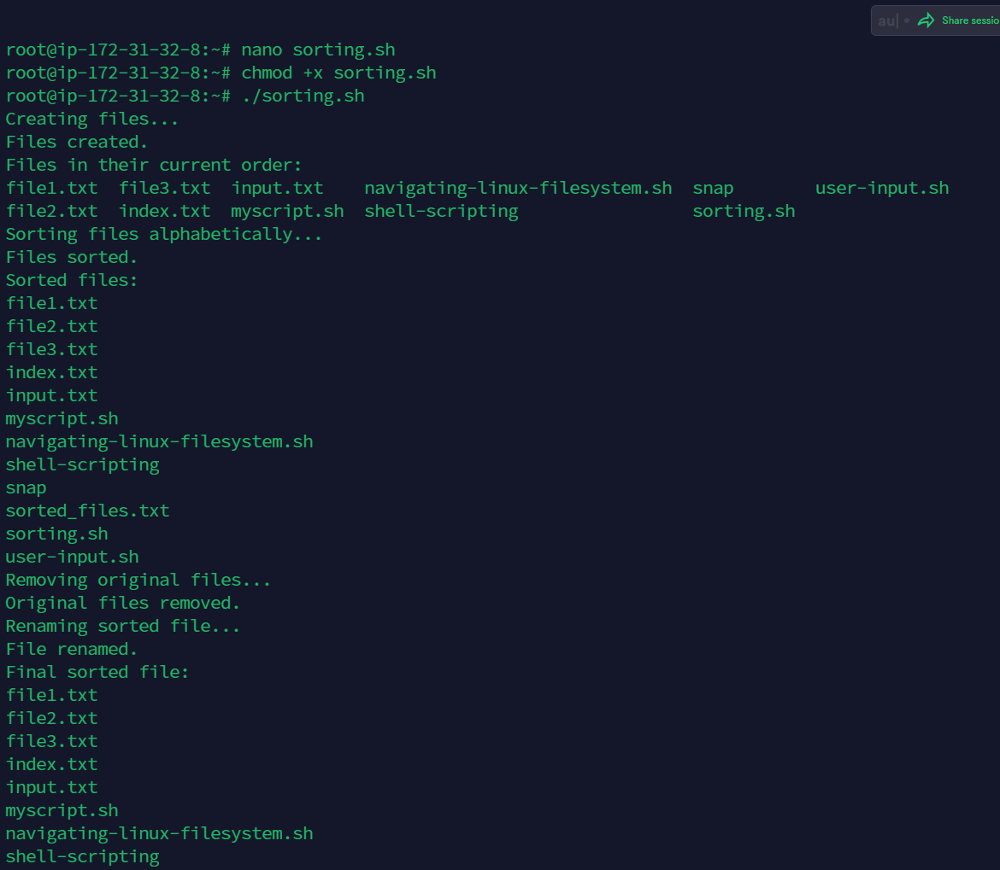


## --- D. WORKING WITH NUMBERS AND CALCULATIONS ---


Step 1. Open a file using the command:
    **`touch calculations.sh`**

Step 2. Paste the code block below into the file

```
#!/bin/bash

# Define two variables with numeric values
num1=10
num2=5

# Perform basic arithmetic operations
sum=$((num1 + num2))
difference=$((num1 - num2))
product=$((num1 * num2))
quotient=$((num1 / num2))
remainder=$((num1 % num2))

# Display the results
echo "Number 1: $num1"
echo "Number 2: $num2"
echo "Sum: $sum"
echo "Difference: $difference"
echo "Product: $product"
echo "Quotient: $quotient"
echo "Remainder: $remainder"

# Perform some more complex calculations
power_of_2=$((num1 ** 2))
square_root=$(echo "sqrt($num2)" | bc)

# Display the results
echo "Number 1 raised to the power of 2: $power_of_2"
echo "Square root of number 2: $square_root"


```

Step 3: Run the command for executing permision:

**`sudo chmod +x calculations.sh`**

Step 4: Run the script using the command:

**`sudo ./calculations.sh`**


Result:

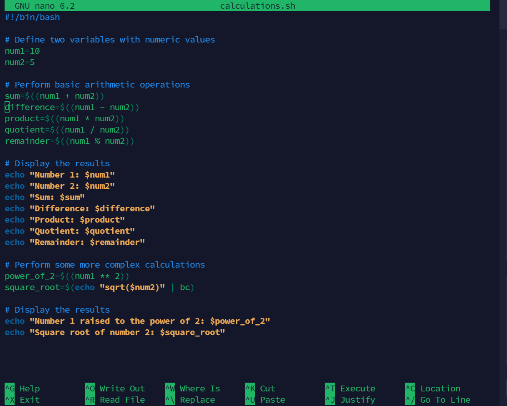

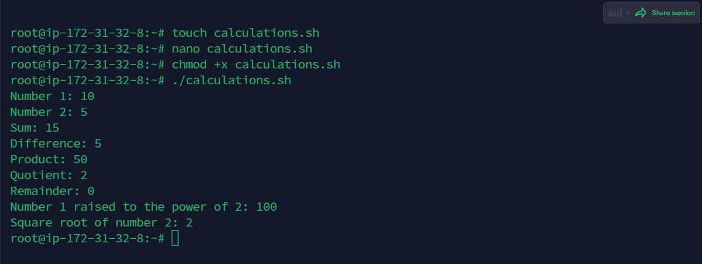


## --- E. FILE BACK-UP AND TIMESTAMPING ---


Step 1. Open a file using the command:
    **`touch backup.sh`**

Step 2. Paste the code block below into the file

```
#!/bin/bash

# Define the source directory and backup directory
source_dir="/path/to/source_directory"
backup_dir="/path/to/backup_directory"

# Create a timestamp with the current date and time
timestamp=$(date +"%Y%m%d%H%M%S")

# Create a backup directory with the timestamp
backup_dir_with_timestamp="$backup_dir/backup_$timestamp"

# Create the backup directory
mkdir -p "$backup_dir_with_timestamp"

# Copy all files from the source directory to the backup directory
cp -r "$source_dir"/* "$backup_dir_with_timestamp"

# Display a message indicating the backup process is complete
echo "Backup completed. Files copied to: $backup_dir_with_timestamp"


```

Step 3: Run the command for executing permision:

**`sudo chmod +x backup.sh`**

Step 4: Run the script using the command:

**`sudo ./backup.sh`**


Result:

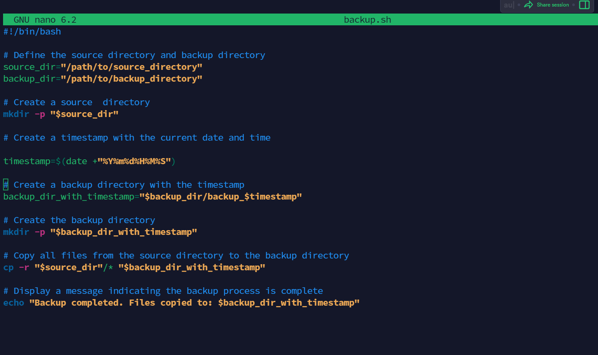

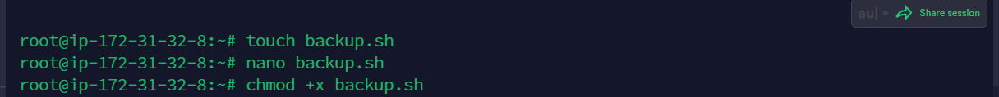

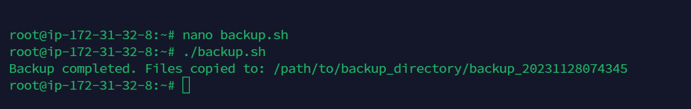
