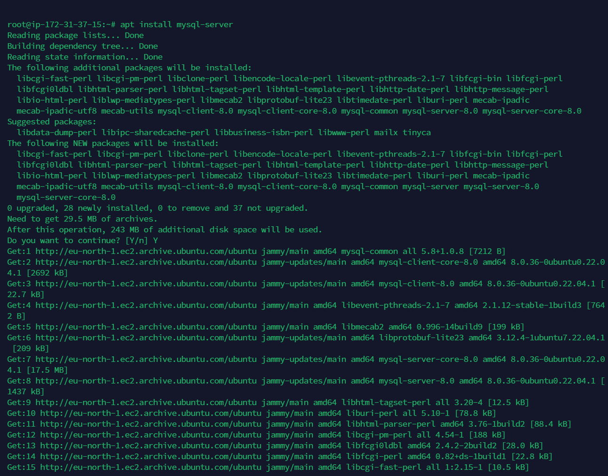

# PROJECT 6 - IMPLEMENTING CLIENT SERVER ARCHITECTURE USING MYSQL DATABASE MANAGEMENT SYSTEM (DBMS)

 ## **This project demonstrates hoe to implement Client Server Architecture using MySQL Databse Management System (DBMS).**

 ## 1. Create 2 Linux-based virtual servers on AWS: 
Server A name - `mysql_server` <br> 
Server B name - `mysql_client`
 
 
 
 

## 2. Install MySQl server on the first instance (mysql_server):

### Run the following commands:
```
sudo apt update
sudo apt install mysql-server
mysql --version

```




### Create Database, Username, Password and grant priveledges on the user


## 3. Install MySQl client on the first instance (mysql_client):

### Run the following commands:
```
sudo apt update
sudo apt install mysql-server
mysql --version

```


## 4. Edit Inbound rule on mysql_client:


## 5. Configure MySQL server to allow connections from remote hosts.

`sudo vi /etc/mysql/mysql.conf.d/mysqld.cnf`
<br><br>


## Finnally: Connect to mysql_server from mysql_client and show databases using the command as below:

```
mysql -u example_user -h 172.31.37.15 -p
show databases;
```


# ----------------------END of Project! Thank you-----------------------